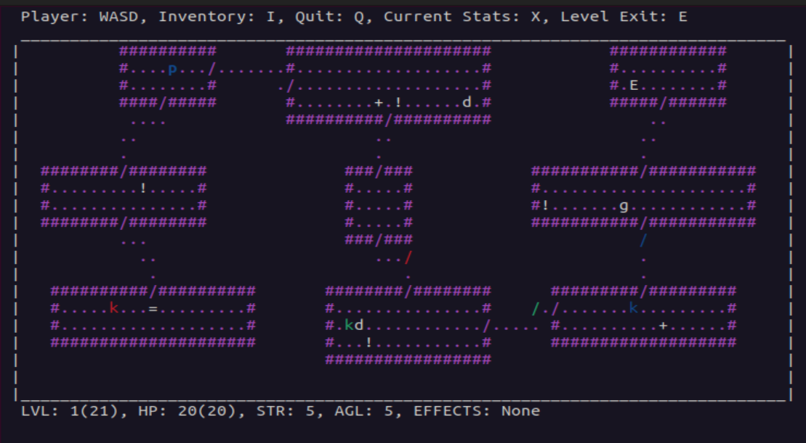

# Rogue Manual

_Last updated May 2025_

_Rogue dungeon level view._

## Introduction

**Rogue** (meaning "rogue" or "scoundrel") is a computer game developed in 1980 by the company Epyx. Its main theme is dungeon exploration. The game was extremely popular on university Unix systems in the early 1980s and spawned an entire genre known as **roguelike** games.

In *Rogue*, the player takes on the typical role of an adventurer in an early fantasy role-playing game. The game begins on the very top level of an unmapped dungeon containing many monsters and treasures. Gradually, as the player progresses deeper into the randomly generated dungeon, the monsters grow stronger and advancing becomes more difficult.

Each dungeon level consists of a 3×3 grid of rooms or a dead-end corridor where one would expect a room at the end. Later variants also included "mazes" — winding corridors with dead ends — alongside the rooms. Unlike most adventure games of that time, the dungeon layout and the placement of objects in it were generated randomly. Thus, each playthrough of the game was unique and equally risky for both beginners and experienced players.

This document describes how to build and run a simplified version of Rogue (developed in C#12 with CLI). It should be fine to run on both Unix-like systems and Windows so long as you have all the dependencies installed.

## Prerequisites

Correct running of the program depends on other utilities and libraries. Check that you have the following before proceeding: 

1. NET Framework 8.0 and higher;

2. NET SDK 8.0 and higher;

3. For Windows: curses library (`pip install windows-curses` or similar) to display graphics.

## Setup

Download or clone (`git clone <link_to_git_folder>`) the source repository to where you can easily find it. Then type and run the following commands in the terminal: 

1. `cd <path_to_git_folder>/src/rogue`

2. `dotnet run`

You can also open and run the project in an IDE or editor such as Visual Studio or Visual Studio Code, provided you have the necessary extensions. If there are errors, you're likely missing some packages. Check __Prerequisites__.

## Rules

- The game contains **21 dungeon levels**: each level consists of **9 rooms**, randomly generated and connected by corridors. All levels start in a room without enemies.

- Some corridors are locked with **coloured doors** that need matching **keys** (displayed as k). Similar to the classic *DOOM*.

- Your goal is to find the exit on every level, thus completing the dungeon. The game is **turn-based**, meaning every player action triggers the actions of enemies.

- Pay attention to your character's **health** (when it reaches 0, the game is over), **agility** (which affects the probability of hitting and being hit by enemies) and **strength** (which determines the damage dealt to enemies).

- Enemies also have health, agility and speed, as well as **hostility**, determining the distance from which they begin to chase the player. There are **6 types of enemies**: 
  - **Zombie** (green z): Low agility. Medium strength and hostility. High health.
  
  - **Vampire** (red v): High agility, hostility, and health. Medium strength. Steals some of the player’s maximum health on a successful attack. The first hit on a vampire always misses.
  - **Ghost** (white g): High agility. Low strength, hostility, and health. Constantly teleports around the room and periodically becomes invisible until the player engages in combat.
  - **Ogre** (yellow O): Moves around the room two tiles at a time. Very high strength and health, but after each attack rests for one turn, then counterattacks. Low agility. Medium hostility.
  - **Snake-Mage** (white s): Very high agility. Moves diagonally across the map, constantly changing direction. Each successful attack has a chance to "stun" the player for one turn. High hostility.
  - **Mimic** (white m): Imitates items. Has high agility, low strength, high health, and low hostility.

- Each enemy, when defeated, drops a random amount of **Coins** depending on its characteristics. Coins accumulate over time and affect the final score. 

- When traversing the dungeon, you'll find some useful items:
  - **Food** (white +) – restores health by a certain amount.
  
  - **Potion** (white d) – temporarily increases either agility, strength, or max health.
  - **Scroll** (white =) – permanently increases either agility, strength, or max health.
  - **Weapon** (white !) – when in hand, increases the player's strength.

- You can collect items by stepping on them, but only 9 items of each type will fit in your backpack.

- With each new level, the number and difficulty of enemies increases, the number of useful items decreases.

### Controls

| Keys | Action |
| ---- | ------ |
| **WASD** | Player movement |
| **I** | Peek into inventory |
| **H** | Use weapon from backpack |
| **J** | Use food from backpack |
| **K** | Use potion from backpack |
| **E** | Use scroll from backpack |
| **L** | Use coloured key |
| **X** | See current session statistics |
| **Q** | Exit the game |

Using any item from the backpack results in printing a list of items of that type on the screen, with a prompt asking which one to use (1–9).

## Statistics

The game collects and displays, in a separate view, statistics of all playthroughs sorted by the number of treasures collected. This statistics include: number of treasures collected, highest level reached, number of enemies defeated, amount of food eaten, number of potions drunk, number of scrolls read, number of hits dealt and taken, and number of tiles traversed.

## Contacts

If you wish to suggest an improvement or report a bug, contact me __@ginzburg_jake (Telegram) or JakeTheSillySnake (GitHub)__.